# Lambda App Store Connect Guide

### **Required**: *You must first request access by filling out this [form](https://forms.gle/WmS5j6tcW9XFEEGv7)*

You will receive an invite via email within 24 hours. If it doesn't arrive within that time, check your junk mail to be sure it didn't end up there. If you are still experiencing issues, reach out to your TL for additional assistance.

## Ground Rules

Students working with the Lambda School AppStore Connect and the Apple Developer accounts have the ability to easily BREAK things. Please observe the following rules so we can avoid a catastrophe:

1. **NEVER, EVER (Nope, *NEVER*) revoke or otherwise delete, modify, fold, spindle or mutilate a certificate, ID or profile that you did not personally create.**
2. **There is *no need* to create your own Production (Distribution) Certificate** - *there are a limited number of certificates overall, and only a handful of those can be issued for Production (Distribution). We have a shared Certificate set up for Lambda Students already, which will be provided to you.*
3. **If you are unsure of whether what you are about to do will, in fact, break something, please ask someone** - *Your instructors, Team Leads and Section Lead are always happy to assist when available.*

## Guide

Once you have been added to Lambda, Inc Apple Development Team:

1. Download the distribution certificate - It will be posted in the main iOS Slack channel for your section (i.e. iOS6) To install it to your keychain, simply double-click the downloaded certificate and folllow the prompts.

2. Go to [App Store Connect](https://appstoreconnect.apple.com/login) > My Apps

	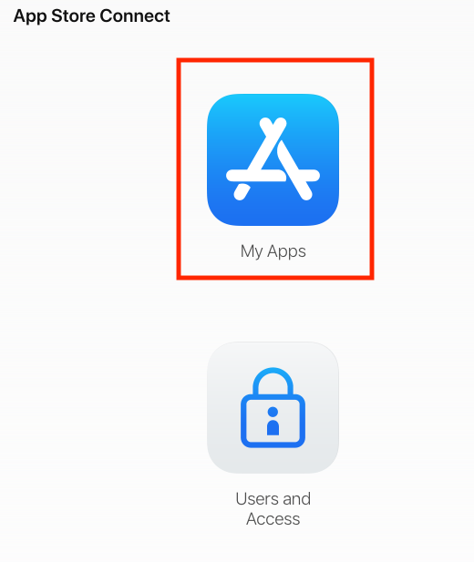
	
3. Click the "+" button to add a "New App"
    
    
    
4. Click "Register a new bundle ID in Certificates, Identifiers & Profiles"
	
	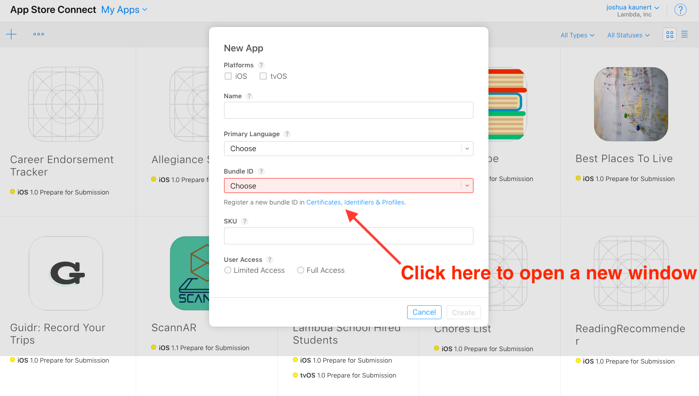
	
5. Select 'Identifiers' from the left Navigation panel, then click the '+' to add a new bundle identifier.

	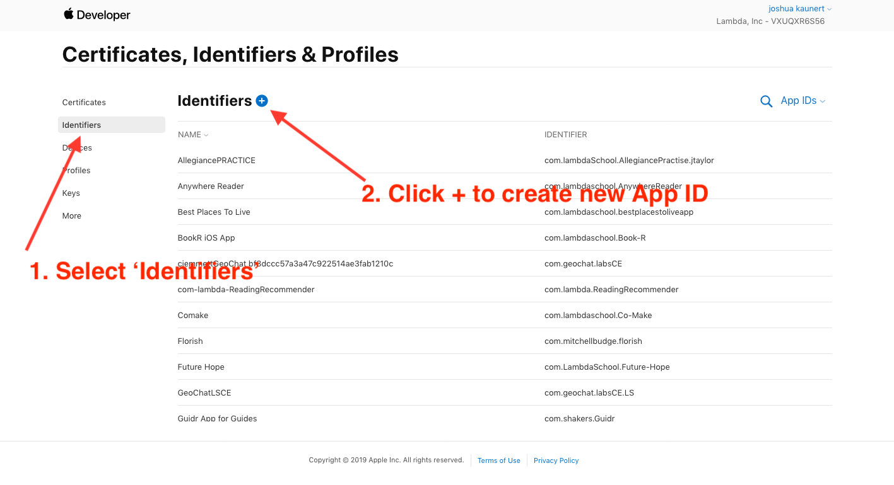
	
6. Select the 'App ID' radio button, then click 'Continue'.

	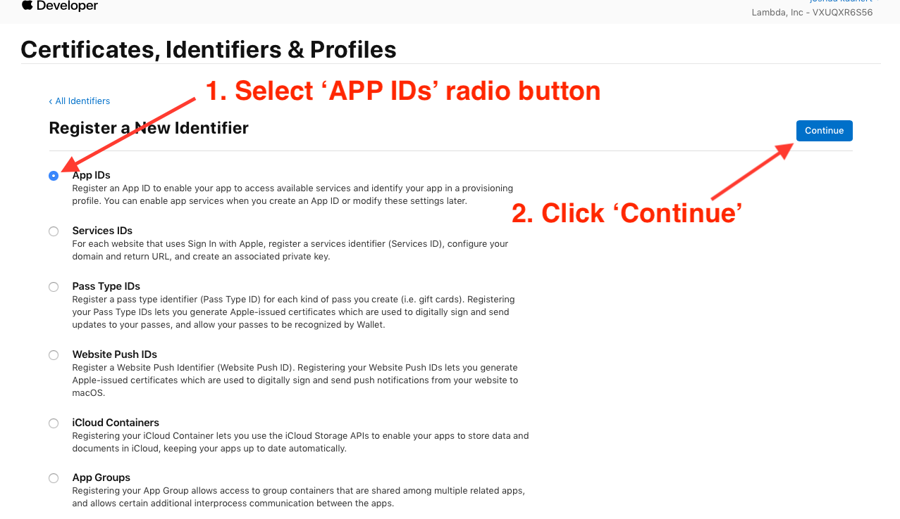
	
7. Choose 'iOS, tvOS, watchOS' as the platform
8. Enter an appropriate description (your AppName is perfect choice)
9. Leave radio button set to explicit and enter your bundle id in the textfield. this must match exactly what you will use for your bundleID in xcode. YOU CANNOT CHANGE THIS LATER!
	
	Example: 
		
		com.lambdaschool.your-app-name-here

10. Select needed capabilities/entitlements. These can be changed later, but you will need to regenerate a new profile each time.
11. click Continue to register the App ID. Next, click on the 'All Identifiers' breadcrumb to return to the 'Certificates, Identifiers & Profiles' dashboard.

	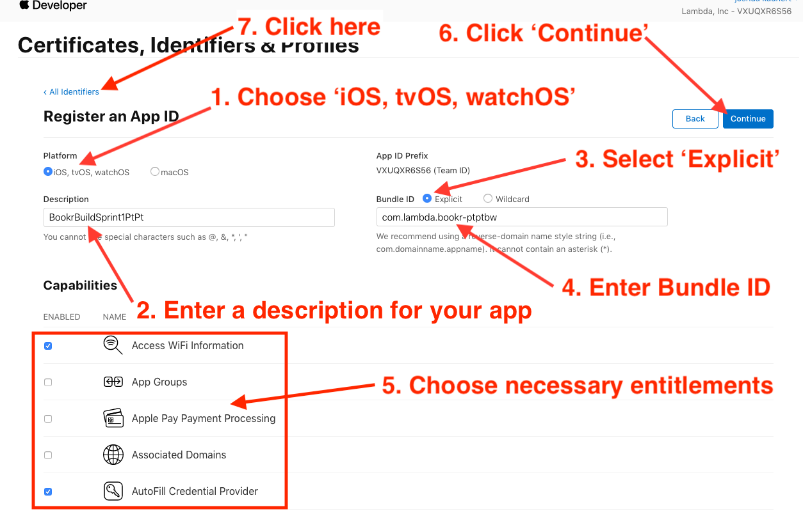
	
12. Select 'Profiles' from the left Navigation panel and then click the '+' to create a new Provisioning Profile.

	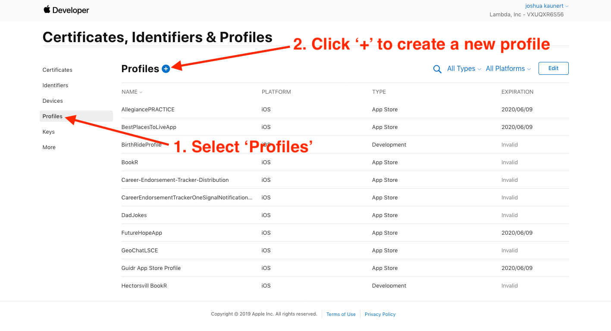
	
13. Select 'App Store' radio button in the 'Distribution' section, and then click 'Continue'

	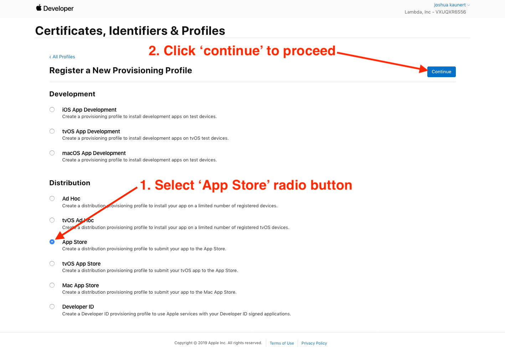
	
14. Select your 'App ID' from the dropdown list and click 'Continue'

	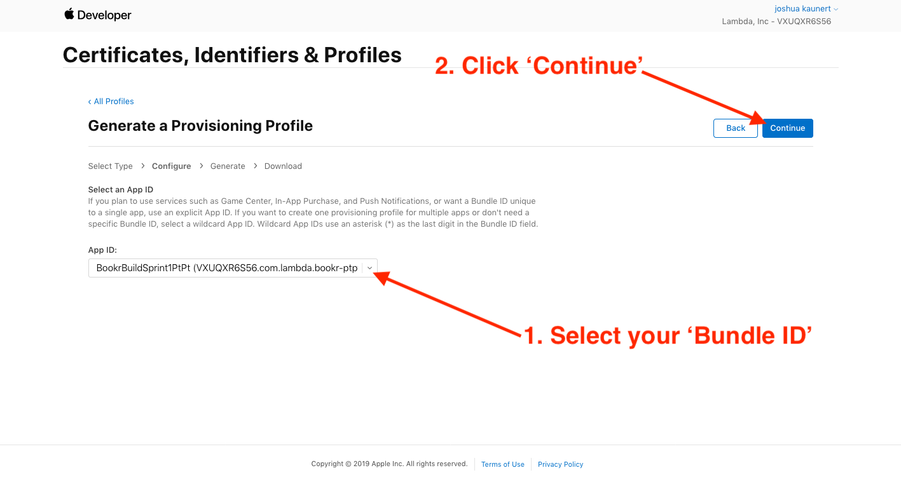
	
15. **Important!!** *make sure you select the correct Distribution Certificate. This must match the certicicate installed on your machine. For pre-Xcode 11, choose `Lambda, Inc (iOS Distribution) Jun 09, 2020` and for Xcode 11 and above, choose `Lambda, Inc (Distribution) For use in Xcode 11 or later Jun 09, 2020`*, then click 'Continue'

	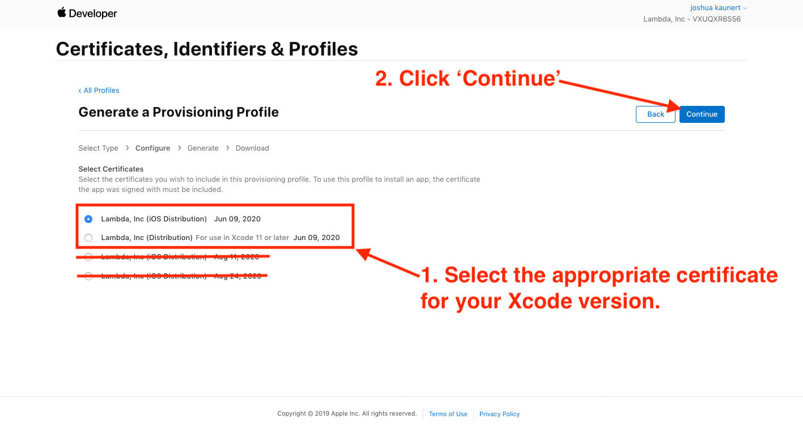
	
16. Choose an appropriate name for the provisioning profile, make sure everything is correct, and click 'Generate'.

	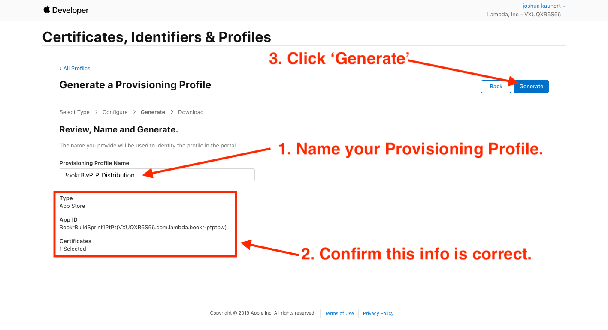
	
17. Click 'Download' to save the provisioning profile to your local machine, and then install it by double clicking the file and folowing any prompts.

	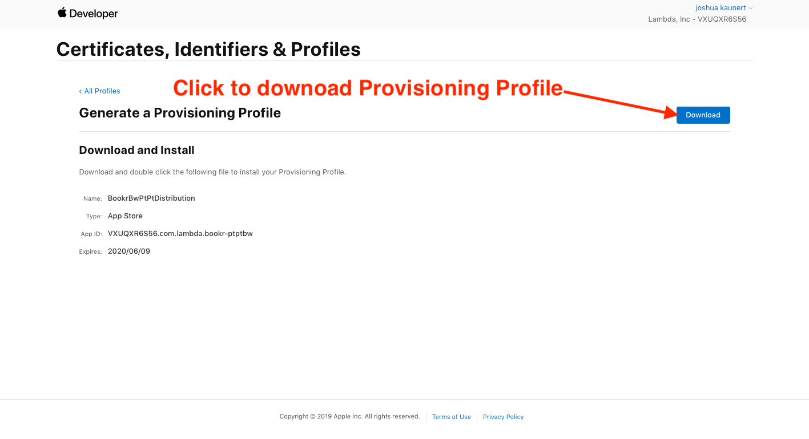
	
18. Go back to the "My Apps" screen you left open in step #4. You can now select your Bundle ID from the dropdown list. Select the 'iOS' checkbox and the 'Full Access' radio button. Choose a primary language, SKU and a name for your App **You might need to be creative with naming, as Apple does not allow duplicate names in the app store.**

	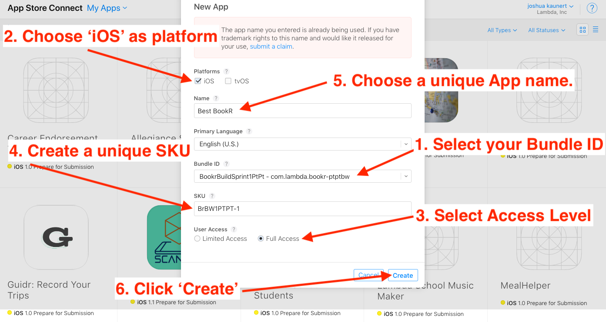
	
19. **BOOM!** *You are now ready to fill out App Information and submit a build to TestFlight.* [**Click Here**](https://help.apple.com/xcode/mac/current/#/dev91fe7130a) and [**Here**](https://help.apple.com/xcode/mac/current/#/dev2539d985f) for **Next Steps**